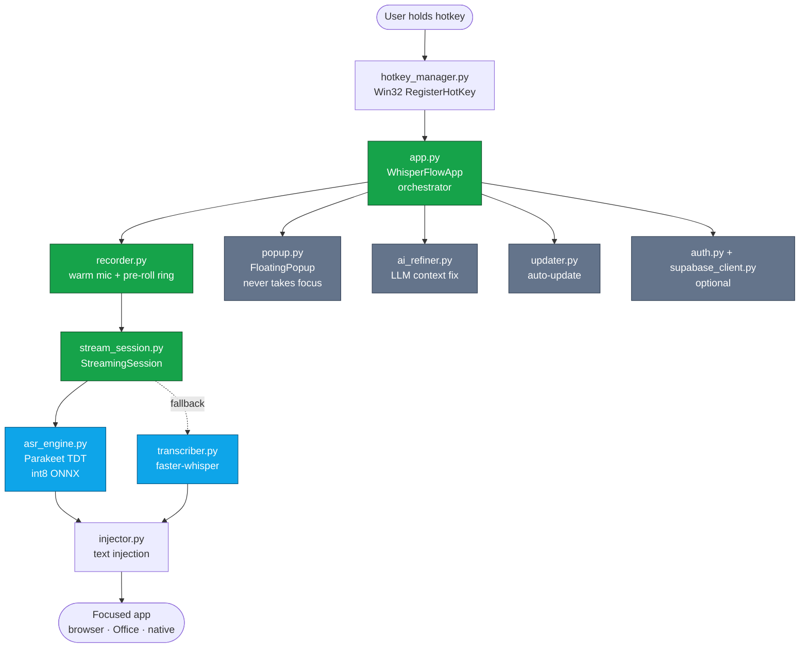
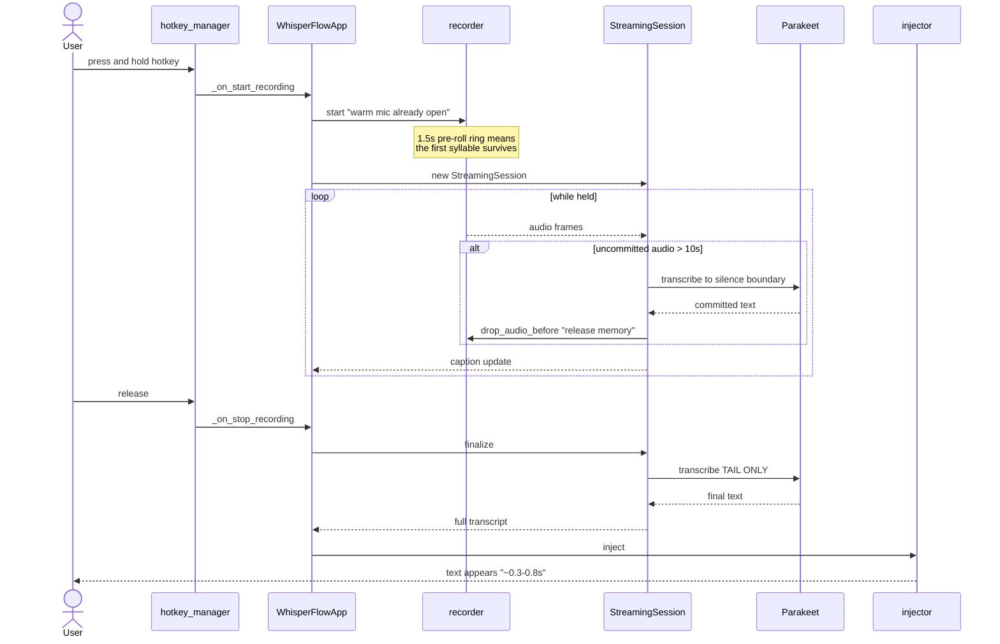
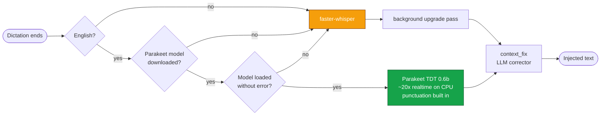
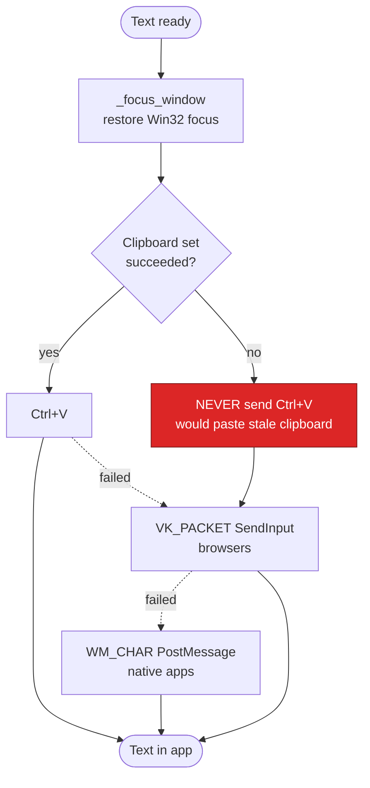
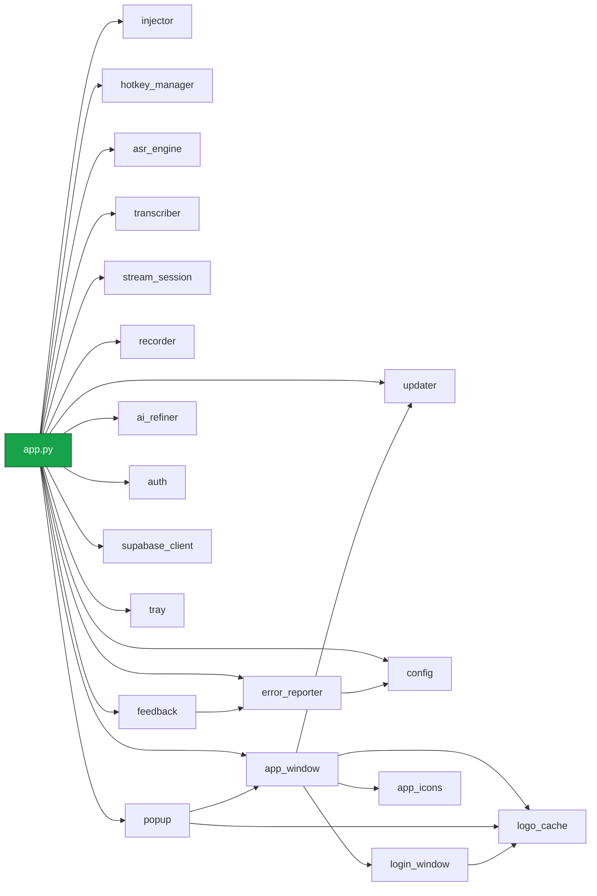
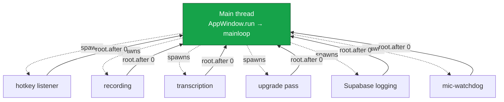
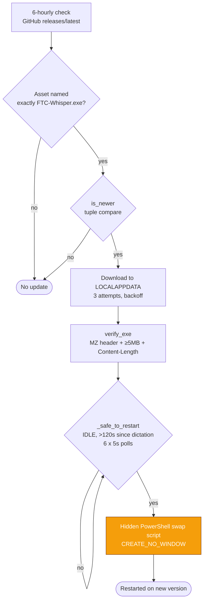

# FTC Whisper — Architecture

Windows push-to-talk dictation. Hold a hotkey, speak, release — the transcribed text
appears in whatever app has focus. Python + tkinter, shipped as a single signed
`FTC-Whisper.exe`.

The whole design serves one goal: **stop-latency stays flat no matter how long you
talk**. Press, speak, release, text. Everything below exists to protect that.

---

## System at a glance



**Green** is the hot path — anything on it affects stop-latency.
**Blue** is speech recognition. **Grey** is off the critical path.

---

## The dictation sequence

This is the flow that matters. Note where `finalize()` sits: it transcribes only the
**tail**, because everything before the last silence boundary was already committed
while the user was still speaking.



That commit-as-you-go loop is why a 30-second dictation stops just as fast as a
3-second one.

---

## Choosing an engine



Parakeet is primary for English because it beats whisper-large-v3 on accuracy at a
fraction of the cost. `context_fix` is **word-count guarded** — if the LLM adds or
drops words, the result is rejected. Output stays exactly what was said.

---

## Injection — three strategies, in order

The injector tries each until one works. All modifiers are released first, otherwise
Office interprets the paste as "Paste Special".



> The red box is a shipped-bug guard. Sending `Ctrl+V` after a failed clipboard write
> pastes whatever was there before — possibly a password — and reports success.

---

## Module dependency map

Generated from the actual import graph, not hand-drawn. `app.py` is the hub: it
imports every subsystem and owns the lifecycle.



---

## Threading model

tkinter owns the main thread. Everything else is a daemon thread — which is why the
UI rules below are absolute.



**Never call a tkinter widget from a background thread.** Always marshal back with
`self._root.after(0, lambda: ...)`, wrapped in try/except — `TclError` and
`RuntimeError` both fire during shutdown.

---

## Update flow

Fully automatic, because users never checked manually.



> The swap script must spawn with `CREATE_NO_WINDOW` and **never** `DETACHED_PROCESS`
> — the two conflict, powershell exits 0 without running, and every in-app update
> silently breaks. This shipped as a real bug through v1.6.3.

---

## Key files

| File | Role |
|---|---|
| `app.py` | Orchestrator — `WhisperFlowApp`, `APP_VERSION` |
| `app_window.py` | Dashboard and settings UI |
| `popup.py` | `FloatingPopup` — borderless, topmost, never takes focus |
| `recorder.py` | Warm mic, pre-roll ring, watchdog |
| `stream_session.py` | Incremental Parakeet, commit-as-you-go |
| `asr_engine.py` | Parakeet TDT int8 ONNX (primary) |
| `transcriber.py` | faster-whisper (fallback) |
| `injector.py` | Three-strategy text injection |
| `hotkey_manager.py` | Win32 `RegisterHotKey` + `keyboard` fallback |
| `ai_refiner.py` | OpenRouter → Anthropic refine |
| `updater.py` | Download, verify, idle-wait, swap |
| `config.py` | `Config` dataclass → `config.json` |
| `ftc_whisper.spec` | PyInstaller build (keys sanitised at build time) |

---

## Explore it yourself

This repo has a queryable knowledge graph built from the AST — 793 nodes, 1469 edges,
no LLM involved.

```bash
graphify explain "StreamingSession"       # what it connects to
graphify path "WhisperFlowApp" "Injector" # how two things relate
graphify query "how does stop latency stay flat?"
```

Open `graphify-out/graph.html` in a browser for the interactive version.
Rebuild after big changes with `/graphify .` — it is free and fully local for code.

---

## Where the rules live

`CLAUDE.md` in the repo root carries the **invariants** — each one encodes a bug that
already shipped. Read it before changing the audio, injection, or update paths. This
document is the map; that one is the minefield.
